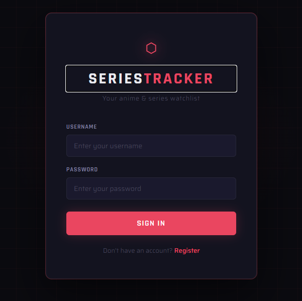
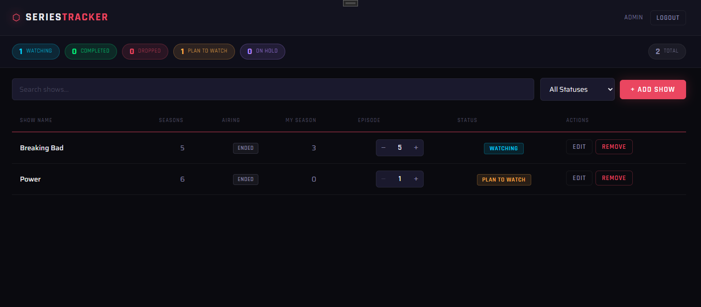

# SeriesTracker

A cross-platform anime and series tracking app built with .NET MAUI Blazor Hybrid and MongoDB Atlas.
**This project is still in development**

## Features

- **User Authentication** — Register and login with securely hashed passwords (BCrypt)
- **Personal Watchlist** — Each user has their own private watchlist stored in MongoDB
- **Track Your Progress** — Log the season and episode you're currently on
- **5 Watch Statuses** — Watching, Completed, Dropped, Plan to Watch, On Hold
- **Episode Controls** — Quickly increment or decrement your current episode from the table
- **Search & Filter** — Search by show name or filter by watch status
- **Status Summary** — At-a-glance count of shows per status at the top of the dashboard

## Tech Stack

| Layer | Technology |
|---|---|
| Framework | .NET MAUI Blazor Hybrid |
| Database | MongoDB Atlas (Free M0 Tier) |
| ODM | MongoDB.Driver (official C# driver) |
| Auth | Custom (BCrypt.Net password hashing) |
| UI | Razor Components + scoped CSS |


## Getting Started

### Prerequisites

- Visual Studio 2022+ with the .NET MAUI workload installed
- .NET 8 or .NET 9 SDK
- A MongoDB Atlas account (free tier is sufficient)

### Setup

1. Clone the repository
2. Create a free MongoDB Atlas cluster and set up a database named `SeriesTracker` with two collections: `Users` and `WatchList`
3. In `MauiProgram.cs` update the connection string with your Atlas credentials:
```csharp
["MongoDB:ConnectionString"] = "mongodb+srv://<user>:<password>@<cluster>.mongodb.net/"
```
4. Open the solution in Visual Studio and install NuGet packages:
```
MongoDB.Driver
BCrypt.Net-Next
```
5. Build and run targeting Windows

## Database Schema

**Users**
```
_id, username, email, passwordHash, createdAt
```

**WatchList**
```
_id, userId, showName, totalSeasons, isOngoing,
currentSeason, currentEpisode, watchStatus, dateAdded, lastUpdated
```

## Notes

- Passwords are never stored in plain text — BCrypt hashing is applied before saving to MongoDB
- MongoDB indexes are created automatically on startup to enforce unique usernames and emails
- Session state is held in memory and cleared on logout






## Configuration

This project requires a MongoDB Atlas connection string which is not committed to the repo.

1. Create a file called `appsettings.Local.json` in the project root
2. Add your credentials:
```json
{
  "MongoDB": {
    "ConnectionString": "your-connection-string-here",
    "DatabaseName": "SeriesTracker"
  }
}
```